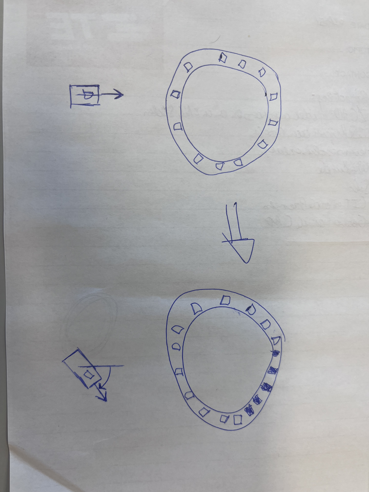

# Overkoepelende opdracht Motion Sensor
> Victor Fransen en Sam Verkimpe
## Inleiding
In dit document lees je alles over ons project, van het initiële idee tot aan de uitvoering en het resultaat.

Voor deze overkoepelende opdracht van Opkomende technologien hebben wij gekozen voor de 'Motion Sensor'. Hier wordt er verwacht input van een gyroscoop om te zetten in een een visuele of auditieve output.

## Aanpak

De eerste stap in een dergelijke opdracht is steeds het kijken wat er gevraagd wordt en met welke rescources je kan werken. Zo hebben wij even snel gebrainstormed over wat we wouden doen met onze motion sensor. Intetieel hadden we het idee gekregen om de output van de gyroscoop om te zetten in ledjes die in een circkelvorm gingen branden, meer specefiek de neopixel led circle (zie onderstaande figuur).

Dit eerste idee kon opgedeeld worden in 2 delen, het uitlezen van de gyroscoop en het besturen van de leds. Voor het proces wat sneller te laten gaan hadden we ervoor gekozen deze twee delen op te splitsen, waarbij dat Victor, de gyroscoop ging uitlezen en Sam de leds ging besturen. Maar deze twee delen kunne niet zo maar communiceren met elkaar, dusdanig hadden we een "mergepoint opgesteld", dit punt was een set van out- en input waardes. Victor zette alle ingelezen waardes van de gyroscoop om in waardes van [0 < x < 360], oftewel 360 graden. Sam zette dan deze waardes om in een vizuele representatie van de gyroscoop in de led ring.

## Feedback

Na een kort feedback moment met de docent werd er ons verteld dat het misschien ook een goed idee zou zijn om van onze uitgelezen waardes van de gyroscoop een visuele representatie te geven op een computer scherm. Natuurlijk wouden we onze voortgang met de leds niet verloren laten gaan, dus die implementatie hebben we nog steeds behouden. Na dit feedback moment heeft Victor ervoor gezorgd dat onze uitgelezen waardes van de gyroscoop ook verchenen kon worden op een scherm.

## Schema

Hieronder kan u het gemaakte schema zien, met de Adafruit neopixel led circle en de gyroscoop.
// nog een foto in plaatsen best

